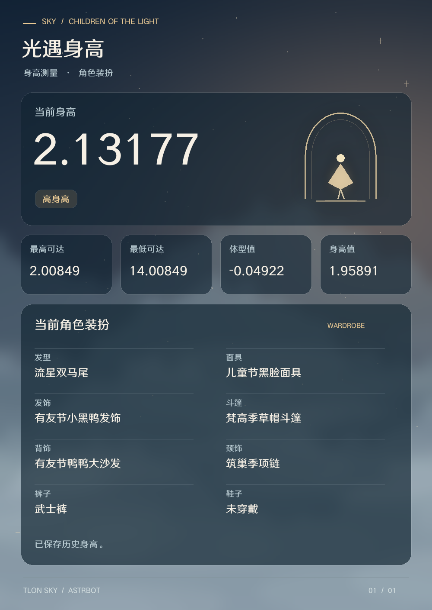

<div align="center">


# Tlon-Sky · 光遇助手

让查询、资产记录和群提醒，在聊天里完成。


[](https://github.com/wzq10314/astrbot_plugin_sky)
[](https://github.com/wzq10314/astrbot_plugin_sky/stargazers)
[](https://github.com/wzq10314/astrbot_plugin_sky/forks)

访问徽章为第三方服务请求计数，不是 GitHub 官方独立访客数。


</div>

> 致敬原作者 **[Tloml-Starry](https://gitee.com/Tloml-Starry)**，感谢开源项目 **[Tlon-Sky](https://gitee.com/Tloml-Starry/Tlon-Sky)** 提供的功能设计、资源与移植基础。
> 本项目借助 AI 工具完成 AstrBot Python 移植与后续适配。这是 [wzq10314/astrbot_plugin_sky](https://github.com/wzq10314/astrbot_plugin_sky) 的 3.0.0 大版本更新，README沿用原仓库的清晰分区，并按当前实现重新编写。

## ✨ 可以做什么

### 3.0.1 图片样式更新

本地报告采用暮色云海、暖金微光和半透明卡片。身高报告突出当前身高，分区展示测量数值与角色装扮；其他文字报告统一样式并自动分页。继续使用 Pillow 和内置中文字体，无需浏览器或在线字体。上游直接返回的攻略图片保持原样。开启 `report_images` 即可使用，关闭时仍发送文字。



| 功能 | 当前实现 |
| --- | --- |
| 日常攻略 | 每日任务、季蜡、大蜡、魔法、活动货币位置、明日任务 |
| 红石日历 | 独角兽API月历、定时群推送、坠落前10分钟提醒 |
| 季节信息 | 季节列表、当前季节结束时间、复刻记录与图鉴 |
| 光翼与身高 | 绑定账号、光翼查询、身高及接口提供的装扮、身高历史 |
| 在线资产 | 用个人token查询蜡烛、季蜡、爱心、红蜡和代币变化 |
| 群提醒 | 每日任务、老奶奶干饭、周日献祭、碎石提醒 |
| 其他 | 游戏状态、公告、礼包查询、好友盲盒、绘画分享 |

支持 `tlon_sky` LLM 工具。可以说“查活动货币在哪里”“查一下我的蜡烛变化”。模型选择命令可能受旧对话影响，排查时先试直接命令。

## 📦 安装与更新

1. 在 AstrBot 插件管理中使用本仓库地址安装/更新，或上传本项目 ZIP 安装包。
2. 在插件配置中填写所需 API 密钥，保存并重载。
3. 发送 `#光遇菜单` 检查加载；发送 `#光遇更新` 查看已加载版本。

适配 AstrBot 4.28.1、Python 3.12、OneBot11/NapCat。依赖见 requirements.txt；项目仓库：https://github.com/wzq10314/astrbot_plugin_sky 。从2.5.3升级前请先阅读 [升级说明](UPGRADE.md)。

更新时覆盖插件源码，不要删除 `data/plugin_data/astrbot_plugin_tlon_sky`。更新前停用插件并备份数据目录和插件配置，避免运行中直接复制SQLite造成不完整备份。

## ⚙️ 主要配置

| 配置 | 用途 |
| --- | --- |
| `ovoav_api_key` | 独角兽接口密钥，需分别具备所用产品权限 |
| `t1qq_api_key` | 每日任务、季蜡、大蜡和魔法图片；可选旧礼包来源 |
| `kevcore_api_key` | 本月日历、可选旧光翼与身高来源 |
| `height_provider` / `wings_provider` / `gifts_provider` | 默认均为 ovoav；旧来源可在后台选择 |
| `candle_tokens` | 可选管理员代填的 QQ→token JSON；用户也可私聊自行绑定 |
| `api_cooldown` | 每人外部查询冷却秒数 |
| `height_daily_limit` | 每人每天身高请求上限，失败请求也计数 |
| `report_images` | 本地文本报告是否渲染成图片，不改变API原生图片 |
| `shard_advance_reminder` | 默认开启，恢复原版红/黑石坠落前10分钟提醒 |
| `push_at_all` | 默认关闭，开启后需机器人拥有@全体权限 |

密钥由各用户自行申请，本项目不提供原作者的私有密钥。接口费用、权限和可用性以提供方为准。

## 🔑 每个人如何绑定 token

私聊机器人发送：

```text
#绑定token 完整小精灵链接或token
#token绑定状态
```

也支持“这是我的token：内容”。收到“已保存”只代表本地保存成功，首次查询才提交给独角兽验证绑定。

随后可在私聊或群聊发送 `#蜡烛变化查询`，只使用当前发送者的账号。`#解绑token` 只能私聊使用，解除本地绑定，不撤销第三方已有授权。群聊绑定会被拒绝。

获取方法可发送 `#光遇token帮助`：第三方教程展示进入小精灵后断网刷新、长按全选复制带token链接的方法，未确认所有游戏版本都支持。当前没有自建扫码授权功能。

token原文存于插件SQLite，未加密；插件不回显token，但AstrBot核心日志、采集与记忆插件可能先记录原消息，应排除绑定内容。不要把带凭据的日志公开。个人绑定优先于后台配置，解绑后不会回退旧token。

## ⌨️ 常用命令

所有命令可加 `#` 或 `/`。

| 分类 | 命令 |
| --- | --- |
| 攻略 | 每日任务、季蜡、大蜡烛、今日魔法、季节任务、明日任务 |
| 活动 | 活动货币位置（也接受活动货币、活动代币点位图） |
| 红石 | 本月碎石、2026年7月碎石、今日红石 |
| 季节 | 季节列表、光遇进度、感恩季多久未复刻 |
| 复刻 | 2026年复刻记录、全部年复刻记录、2026年复刻日历 |
| 光翼 | 光遇绑定 短ID、光遇ID列表、光遇切换 序号、光遇删除 序号、光翼查询、光翼详情、光翼统计 |
| 身高 | 光遇绑定好友码 好友码、光遇绑定长ID 长ID、光遇身高查询、光遇历史身高、光遇身高排行榜 |
| 资产 | 蜡烛变化查询、季节蜡烛查询、爱心变化查询、升华蜡烛查询、点赞爱心查询、魔法变化查询、代币变化查询、我的光遇id |
| 礼包 | 国服id绑定 好友码、国服id列表、国服id切换 序号、国服id删除 序号、国服礼包查询 |
| 其他 | 光遇状态、光遇公告、光遇下载、全图鉴参考、光遇本月日历、光遇绘画分享 |
| 盲盒 | 私聊存入盲盒好友码*国服、随机好友盲盒 |

手动蜡烛记账已经删除。“蜡烛记录”只在LLM入口作为旧查询名称转到token查询，不会恢复写入旧账本。资产变化记录不保证等于即时余额。

## ⏰ 群推送与提前提醒

由群主、群管理员或 AstrBot 管理员在**目标群**发送：

```text
#开启每日任务推送
#开启老奶奶干饭提醒
#开启献祭刷新提醒
#开启碎石提醒
#光遇推送状态
```

将“开启”改为“关闭”即可取消。每个群独立订阅，不必填写群号；多群分别开启。订阅重载后保留。

- 时间均为北京时间，后台 `daily_times`、`grandma_times`、`sacrifice_times`、`shard_times` 接受逗号分隔的 HH:MM。
- 献祭提醒只在周日执行。每日任务图片需要t1qq权限。
- 碎石定时推送调用独角兽172月历；`今日红石`也返回本月日历供查看当天，并非每日详情接口。
- **提前10分钟提醒已恢复**：只有开启碎石订阅的群才接收，`shard_advance_reminder=false` 可全局关闭。原版时刻表同时包括红石和黑石。
- **提醒时刻来自内置表，并非API核验**：172只提供月历，没有可读取的逐次坠落时刻。消息会注明此限制；不会从图片猜时间，也没有恢复本地地图或月历推算。
- 按分钟去重；离线错过不补发，发送结果不确定不自动重发。旧 `shard_image` 配置不再使用。

## 🌐 数据来源与边界

独角兽文档：[身高144](https://www.ovoav.com/doc/144) · [光翼184](https://www.ovoav.com/doc/184) · [礼包169](https://www.ovoav.com/doc/169) · [资产174](https://www.ovoav.com/doc/174) · [季节180](https://www.ovoav.com/doc/180) · [进度15](https://www.ovoav.com/doc/15) · [活动货币22](https://www.ovoav.com/doc/22) · [明日任务178](https://www.ovoav.com/doc/178) · [红石月历172](https://www.ovoav.com/doc/172)。

进度接口只提供季节结束时间；明日任务按北京时间日期筛选，缺少明天数据会明确提示。部分图片接口无返回示例，已兼容图片和常见JSON地址结构，不能保证未来格式不变。礼包曾返回“国服更改礼包接口”，尚不能确认已恢复。其他复刻、图鉴仍使用原项目公开资源源。

回归测试使用Python、SQLite、Pillow及模拟的API/QQ事件；没有连接用户的AstrBot验证真实付费查询或长期推送。报告问题请提供已加载版本、命令、脱敏后的工具参数和错误结果。

## 🙏 致谢与许可证

- [Tloml-Starry / Tlon-Sky](https://gitee.com/Tloml-Starry/Tlon-Sky)：原始项目、功能设计及资源，感谢原作者的持续分享。
- [wzq10314](https://github.com/wzq10314)：AstrBot移植仓库维护。
- AstrBot、NapCat、独角兽API，以及原项目使用的网易与Kevin1217资源维护者。

采用 **Mulan PSL v2**，见 [LICENSE](LICENSE)。资源署名和第三方权利说明见 [NOTICE.md](NOTICE.md)，功能移植对应见 [功能对照.md](功能对照.md)。不是光遇、网易或API平台的官方产品，也不暗示原作者为本移植版提供支持。
